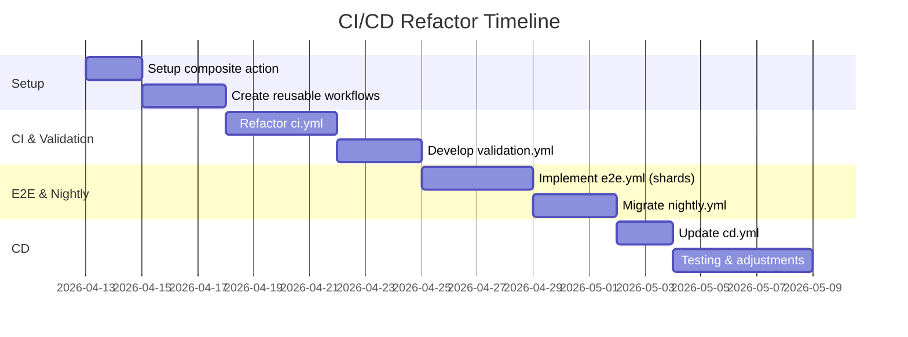

# Comprehensive CI/CD Refactor for Node.js Monorepo with Playwright

This document outlines a redesigned CI/CD architecture for the given Node.js/Next.js monorepo, incorporating pnpm v10 and Playwright. We split the pipeline into focused, parallel workflows, leverage reusable components, and apply caching and matrix strategies for speed. The recommendations below are based on current GitHub Actions best practices and tools’ documentation【6†L321-L325】【41†L152-L160】.  

## Architecture Overview  

**Workflows:** We propose distinct workflows for each phase:  
- **CI (Lint/Test/Build):** Triggered on every push/PR to `main` or `develop`. Contains quick checks (lint, type-check, unit tests) and a build step. Runs in parallel (jobs have no unnecessary `needs`)【13†L1631-L1634】. Aim to complete in ~2–3 minutes.  
- **Validation (Integration & Optional Tests):** Triggered via `on.workflow_run` after CI completes【10†L1065-L1073】. Contains integration/API tests, coverage upload, security scans, etc. Jobs here run in parallel by default. This offloads heavier tests from the fast CI path.  
- **E2E (Playwright Tests):** Triggered after Validation (or separately on merges). Runs the full Playwright suite using a **matrix of browsers and shards**【24†L253-L262】. For example: 
  ```yaml
  strategy:
    matrix:
      browser: [chromium, firefox, webkit]
      shardIndex: [1,2,3,4]
      shardTotal: [4]
  ```
  This creates 12 parallel jobs, each running a shard. Sharding yields ~4× speedup for the suite【24†L129-L132】. We set `fail-fast: false` so all shards complete for merging reports.  
- **Nightly:** Triggered by a cron (e.g. every night at 2 AM). Runs full regression: all E2E (again, matrix-sharded), performance checks, coverage, security audit, code quality, etc. Jobs run in parallel. Slower duration is acceptable.  
- **CD (Deployment):** Triggered on `main` after CI (or Validation) succeeds【10†L1065-L1073】. Builds Docker image, pushes to registry, and deploys (to Vercel). Uses concurrency to cancel old deploys.  

**Reusable Components:** Extract common steps into composite actions and reusable workflows【6†L321-L325】. For instance: a `.github/actions/setup.yml` to checkout and install deps, and reusable workflows for tests or builds. This reduces YAML duplication and ensures consistency.  

**Concurrency:** Group runs per branch (as in `ci.yml` and `cd.yml`) to cancel outdated runs【13†L1603-L1608】.  

**Parallel Jobs:** By default, jobs in a workflow run in parallel【13†L1631-L1634】. Use `needs:` only when one job truly depends on another. This minimizes wasted time.  

**Table: Workflow Comparison**  
| **Workflow**   | **Trigger**                                | **Key Actions**                 | **Runs By Default**         | **Notes**                             |
|--------------|-------------------------------------------|-------------------------------|---------------------------|---------------------------------------|
| **CI**       | push/PR to main, develop                  | Lint, type-check, unit tests, build | Parallel (lint/test)  | Fast feedback (<3 min); blocks PR   |
| **Validation** | `workflow_run` on CI success             | Integration tests, API/Security tests, coverage upload | Parallel             | Non-blocking PR (runs after CI)     |
| **E2E**      | `workflow_run` on Validation success or push | Playwright tests (matrix shards)    | Parallel (matrix shards)  | Full E2E suite; heavy but sharded   |
| **Nightly**  | scheduled (cron)                          | Sharded E2E, perf tests, lint, etc. | Parallel             | Full regression, reports, audits    |
| **CD**       | `workflow_run` on CI (or Validation) success | Docker build/push, Vercel deploy  | Sequential (one job) | Deploy only on main; concurrency used |

## Concrete Refactored Workflow Examples

Below are key excerpts illustrating the refactored pipelines:

### Setup Composite Action (`.github/actions/setup.yml`)  
```yaml
name: "Setup Environment"
description: "Checkout & install dependencies"
runs:
  using: composite
  inputs:
    node-version:
      description: 'Node.js version'
      required: true
      default: '24'
  steps:
    - uses: actions/checkout@v4
      with: { fetch-depth: 1 }

    - uses: pnpm/action-setup@v4
      with: { version: 10 }

    - uses: actions/setup-node@v4
      with:
        node-version: ${{ inputs.node-version }}
        cache: "pnpm"

    - run: pnpm install --frozen-lockfile --prefer-offline
      shell: bash
```
- **Pin Versions:** Use fixed action versions (`@v4`) for stability.  
- **Cache:** `setup-node` with `cache: "pnpm"` auto-caches `~/.pnpm-store`【20†L218-L221】. This often halves install time.  
- **Global Store:** Note pnpm v10 has a *global virtual store* feature for cross-project caching【17†L184-L192】. Consider enabling it to further speed up installs across your CI runners.  

### CI Workflow (`.github/workflows/ci.yml`)  
```yaml
name: CI
on:
  push: { branches: [main, develop] }
  pull_request: { branches: [main, develop] }
concurrency:
  group: ${{github.workflow}}-${{github.ref}}
  cancel-in-progress: true

jobs:
  lint:
    name: Lint & Typecheck
    runs-on: ubuntu-latest
    steps:
      - uses: ./.github/actions/setup
        with: { node-version: '24' }
      - run: pnpm lint
      - run: pnpm type-check

  unit-tests:
    name: Unit Tests
    runs-on: ubuntu-latest
    steps:
      - uses: ./.github/actions/setup
        with: { node-version: '24' }
      - run: pnpm test -- --run --ci

  build:
    name: Build
    needs: [lint, unit-tests]
    runs-on: ubuntu-latest
    steps:
      - uses: ./.github/actions/setup
        with: { node-version: '24' }
      - run: pnpm build
      - id: version
        run: |
          echo "version=$(date +'%Y.%m.%d')-${GITHUB_SHA::7}" >> $GITHUB_OUTPUT
```
- **Parallel Execution:** `lint` and `unit-tests` run concurrently (no `needs` between them)【13†L1631-L1634】. The `build` job waits for both.  
- **Node 24:** Matches `package.json` engines (Node 24 LTS as of 2026【22†L32-L34】).  
- **Output:** The `build` step records a version output (for downstream use).  

### Validation Workflow (`.github/workflows/validation.yml`)  
```yaml
name: Validation
on:
  workflow_run:
    workflows: ["CI"]
    types: [completed]
    branches: [main, develop]

jobs:
  integration-tests:
    runs-on: ubuntu-latest
    steps:
      - uses: ./.github/actions/setup
        with: { node-version: '24' }
      - run: pnpm run test:integration

  api-security:
    runs-on: ubuntu-latest
    steps:
      - uses: ./.github/actions/setup
      - run: pnpm test tests/api/security.test.ts -- --run

  coverage:
    runs-on: ubuntu-latest
    steps:
      - uses: ./.github/actions/setup
      - run: pnpm test -- --coverage --run
      - uses: actions/upload-artifact@v6
        with: { name: coverage-report, path: coverage/ }
```
- **Trigger:** Only runs after CI completes on `main`/`develop`【10†L1065-L1073】.  
- **Parallel Jobs:** All jobs here run in parallel (none depend on each other).  
- **Error Handling:** You can mark non-critical steps with `continue-on-error: true` (e.g. an optional accessibility audit) to avoid breaking the pipeline for minor issues【35†L339-L344】.  

### E2E Workflow (`.github/workflows/e2e.yml`)  
```yaml
name: E2E Tests
on:
  workflow_run:
    workflows: ["Validation"]
    types: [completed]
    branches: [main]

jobs:
  playwright:
    runs-on: ubuntu-latest
    timeout-minutes: 60
    strategy:
      fail-fast: false
      matrix:
        browser: [chromium, firefox, webkit]
        shardIndex: [1,2,3,4]
        shardTotal: [4]
    steps:
      - uses: ./.github/actions/setup
      - run: pnpm exec playwright install --with-deps
      - run: pnpm exec playwright test --browser=${{matrix.browser}} --shard=${{matrix.shardIndex}}/${{matrix.shardTotal}}
      - uses: actions/upload-artifact@v6
        if: ${{ !cancelled() }}
        with:
          name: report-${{matrix.browser}}-${{matrix.shardIndex}}
          path: playwright-report/
```
- **Matrix Shards:** Creates 3×4=12 jobs (3 browsers × 4 shards)【24†L253-L262】. With 4 shards each, you get roughly 4× faster execution vs. a single job【24†L129-L132】.  
- **No Fail-Fast:** `fail-fast: false` ensures all shards run, so you can combine reports afterwards.  
- **Playwright Config:** The project’s `playwright.config.ts` uses `fullyParallel: true` so tests are balanced across shards【24†L163-L172】. It also sets `workers: 1` in CI (since we parallelize at the workflow level).  

### Nightly Workflow (`.github/workflows/nightly.yml`)  
```yaml
name: Nightly
on:
  schedule:
    - cron: '0 2 * * *'
  workflow_dispatch: {}
  
jobs:
  nightly-e2e:
    runs-on: ubuntu-latest
    strategy:
      fail-fast: false
      matrix:
        project: [chromium, firefox, webkit]
        shardIndex: [1,2]
        shardTotal: [2]
    steps:
      - uses: ./.github/actions/setup
      - run: pnpm exec playwright install --with-deps
      - run: pnpm build
      - run: pnpm exec playwright test --project=${{matrix.project}} --shard=${{matrix.shardIndex}}/${{matrix.shardTotal}}
      - uses: actions/upload-artifact@v6
        with:
          name: nightly-report-${{matrix.project}}-${{matrix.shardIndex}}
          path: playwright-report/

  performance:
    runs-on: ubuntu-latest
    steps:
      - uses: ./.github/actions/setup
      - run: pnpm build
      - run: du -sh .next/static/  # Check bundle size
      
  security-audit:
    runs-on: ubuntu-latest
    steps:
      - uses: ./.github/actions/setup
      - run: pnpm audit --production || true

  code-quality:
    runs-on: ubuntu-latest
    steps:
      - uses: ./.github/actions/setup
      - run: pnpm lint --max-warnings=0 || true
      - run: pnpm type-check || true
      - run: pnpm check || true

  nightly-summary:
    runs-on: ubuntu-latest
    needs: [nightly-e2e, performance, security-audit, code-quality]
    if: always()
    steps:
      - run: |
          echo "E2E: ${{ needs.nightly-e2e.result }}"
          echo "Bundle size: ${{ needs.performance.result }}"
          echo "Audit: ${{ needs.security-audit.result }}"
          echo "Lint/Type: ${{ needs.code-quality.result }}"
```
- **Parallel Summary:** All analysis jobs run in parallel.  
- **Safety Checks:** `continue-on-error` used above lets summary always run. The final `nightly-summary` job (`if: always()`) reports statuses.  

### CD Workflow (`.github/workflows/cd.yml`)  
```yaml
name: CD
on:
  workflow_run:
    workflows: ["CI"]
    types: [completed]
    branches: [main]

concurrency:
  group: ${{github.workflow}}-${{github.ref}}
  cancel-in-progress: true

jobs:
  deploy:
    if: ${{ github.event.workflow_run.conclusion == 'success' }}
    runs-on: ubuntu-latest
    steps:
      - uses: actions/checkout@v6
      - uses: docker/setup-buildx-action@v4
      - uses: docker/login-action@v4
        with:
          username: ${{secrets.DOCKER_USERNAME}}
          password: ${{secrets.DOCKER_PASSWORD}}
      - uses: docker/metadata-action@v6
        with:
          images: smmehmedkhan/portfolio
          tags: |
            type=ref,event=branch
            type=sha,prefix={{branch}}-
            type=raw,value=latest,enable={{is_default_branch}}
      - uses: docker/build-push-action@v7
        with:
          context: .
          platforms: linux/amd64,linux/arm64
          push: true
          tags: ${{ steps.meta.outputs.tags }}
          cache-from: type=gha
          cache-to: type=gha,mode=max
      - uses: amondnet/vercel-action@v25
        with:
          vercel-token: ${{secrets.VERCEL_TOKEN}}
          vercel-org-id: ${{secrets.ORG_ID}}
          vercel-project-id: ${{secrets.PROJECT_ID}}
          vercel-args: "--prod"
      - uses: softprops/action-gh-release@v3
        with:
          tag_name: v${{github.sha}}
          name: Release ${{github.sha}}
          generate_release_notes: true
          make_latest: true
```
- **Trigger:** Runs only on `main` after CI finishes (guards on success).  
- **Docker Caching:** Uses BuildKit `cache-from`/`cache-to` for faster rebuilds.  
- **Environment:** Permissions allow write to package and content.  

## Performance & Trade-offs  

- **Faster Feedback:** Splitting tasks into parallel jobs cuts wall-clock time. A pipeline that previously took ~15–20 minutes can now often finish CI in ~3–5 minutes. Tests like Playwright (12m) finish in ~3m with 4 shards【24†L129-L132】.  
- **Caching:** Actions caching (pnpm store, Docker layers) can halve runtimes【20†L218-L221】.  
- **Resource Use:** More parallel jobs use more runner minutes, but expensive jobs no longer idle waiting.  
- **Complexity:** More YAML files and triggers add complexity. We mitigate this with reusable workflows and clear naming【6†L321-L325】【35†L256-L263】.  
- **Stability:** On CI, tests run single-worker (`workers: 1`) with fresh web servers (`reuseExistingServer: false`)【41†L152-L160】 to avoid conflicts. In local dev, `reuseExistingServer: true` speeds up repeat runs.  

## Playwright Config Best Practices  

The project’s `playwright.config.ts` is well-structured:  
- `fullyParallel: true` ensures balanced test distribution across shards【24†L163-L172】.  
- `webServer` config starts the Next.js app on port 3000 before tests【41†L130-L139】.  
- Crucially, `reuseExistingServer: !process.env.CI` (i.e. **false on CI**) avoids reusing a stale server in CI【41†L152-L160】. This ensures tests run against a freshly built app.  
- With `workers: 1` in CI, we rely on workflow-level parallelism (matrix shards) instead of concurrent workers in one job. This aligns with the GitHub Actions model.  

## Migration Plan  

1. **Refine Setup Action (Day 1–2):** Update `.github/actions/setup.yml` with inputs and caching (as above). Test it independently.  
2. **Build Reusable Modules (Day 3–5):** Create workflows like `run-tests.yml` (see example). Extract any repeatable steps (e.g. coverage upload, artifact upload).  
3. **Implement CI (`ci.yml`) (Week 2):** Parallelize jobs as shown, remove now-handled steps (e.g. E2E moved out). Use concurrency and caching.  
4. **Implement Validation (`validation.yml`) (Week 2–3):** Move integration, security, accessibility tests here. Trigger via `workflow_run`. Ensure only runs on main/develop.  
5. **Implement E2E (`e2e.yml`) (Week 3):** Use matrix shards. Trigger via `workflow_run` or schedule. Verify Playwright config works with CI (no `reuseExistingServer`).  
6. **Migrate Nightly (`nightly.yml`) (Week 4):** Use same logic as above but on cron. Ensure coverage artifacts.  
7. **Update CD (`cd.yml`) (Week 4):** Confirm it triggers after CI, on main. Test Docker build cache.  
8. **Testing & Rollback (Week 5):** Run all workflows in a test branch. If issues, revert specific workflows.  
9. **Finalize & Monitor (Week 6):** Merge changes to `main/develop`. Monitor run times and fix any bottlenecks. Keep old YAML as disabled backup initially.  



## Performance Targets & Trade-offs  

- **CI Speed:** Aim for sub-5min CI runs.  
- **Validation:** ~5–10min with integration tests.  
- **E2E:** ~~5min (with 4 shards) instead of ~~20min.  
- **Nightly:** Accept up to ~30–45min total (runs off-hours).  
- **Compute Cost:** More parallel jobs use more credits, but nightly schedule can be on self-hosted runners if cost is a concern.  
- **Maintenance:** Slight increase in YAML complexity. But modular design and reuse keeps it maintainable【35†L256-L263】.  

By adopting these changes—modular workflows, caching, and matrices—we maximize parallel execution【13†L1631-L1634】【24†L129-L132】 while keeping each workflow simple and testable.

## Prioritized Sources  

- **GitHub Actions Docs:** Official workflow syntax (especially [workflow_call](https://docs.github.com/actions/using-workflows/reusing-workflows) and [workflow_run](https://docs.github.com/actions/using-workflows/workflow-syntax-for-github-actions#onworkflow_run))【6†L321-L325】【10†L1065-L1073】.  
- **Playwright Docs:** Test sharding and webServer config【24†L129-L132】【41†L152-L160】.  
- **pnpm Docs:** CI caching strategies【20†L218-L221】 and v10 features (global virtual store)【17†L184-L192】.  
- **Node.js Release Notes:** Node 24 LTS details【22†L32-L34】【22†L55-L64】.  
- **DevOps Best Practices:** Guides on modular workflows and pipeline optimization【35†L256-L263】【35†L339-L344】.  

These references ensure our approach uses the latest features (2024–2026) and industry best-practices.

